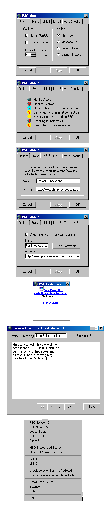



## PSC Monitor \- Now downloads in a separate thread for increased speed and stability

### Description

Are you addicted to PSC? Does visiting PSC actually get in the way of your coding? This may help. It checks for new submissions and new votes on your submissions. Now updated to include new comments notification and viewing all comments. It also provides links to the most common pages you use, all in a popup menu in the system tray. Demonstrates downloading using API, disabling right-click menu in web browsers, string parsing, system tray management, internet connection state, handing multiple settings using the registry.

UPDATE:

The original version of this PSC Monitor used API to download the source code of a selected PSC web page and parsed this source code for specific data. It did this job well, but the application was unresponsive whilst downloading was taking place.

To overcome this problem it now uses a separate tiny exe file (BBdowner.exe - source code included) to download the data in a separate thread, thus allowing for multiple tasks being carried out simultaneously and allowing the app to be reponsive even during downloading.

I hope you appreciate the increased stability and speed.

Before running PSC Monitor, compile BBdowner.exe and place in the same folder as PSCMonitor.exe, thats all - easy!
 
### More Info
 

             |
---                |---
**Submitted On**   |2002-06-18 04:07:52
**By**             |[MrBobo](https://github.com/Planet-Source-Code/PSCIndex/blob/master/ByAuthor/mrbobo.md)
**Level**          |Intermediate
**User Rating**    |4.9 (249 globes from 51 users)
**Compatibility**  |VB 6\.0
**Category**       |[Internet/ HTML](https://github.com/Planet-Source-Code/PSCIndex/blob/master/ByCategory/internet-html__1-34.md)
**World**          |[Visual Basic](https://github.com/Planet-Source-Code/PSCIndex/blob/master/ByWorld/visual-basic.md)
**Archive File**   |[PSC\_Monito955256172002\.zip](https://github.com/Planet-Source-Code/mrbobo-psc-monitor-now-downloads-in-a-separate-thread-for-increased-speed-and-stability__1-35489/archive/master.zip)

